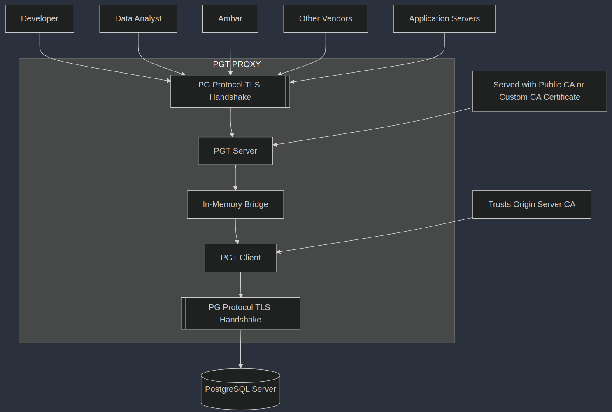

# PGT-Proxy

PostgreSQL TLS Proxy is an intermediary server to easily and securely connect TLS enabled PG clients to 
TLS enabled PG servers. 

- Deployable via Docker image [on DockerHub](https://hub.docker.com/r/ambarltd/pgt-proxy)
- Source code for Docker deployment available [on GitHub](https://github.com/ambarltd/pgt-proxy-docker)
- Read why we open sourced PGT Proxy [on our website](https://ambar.cloud/blog/connect-to-postgresql-securely-with-pgt-proxy)



---

## About PGT-Proxy

### Motivations

1. Enable full TLS verification of PG servers using non-public certificate authorities
2. For PG servers located in private networks, securely expose them to IP addresses outside their private networks
3. Enforce TLS communication from PG clients to PG servers

**How?** PGT-Proxy only ever communicates through TLS. PGT-Proxy enables you to specify the proxy's TLS private key and 
certificate when it acts as a PG server. PGT-Proxy enable you to specify the certificate authorities it trusts
when it acts as a PG client.

### Tenets

1. **Security**
2. **Frictionless experience for PG clients**

### Discussion

1. Enable full TLS verification of PG servers with non-public certificate authorities.
    - PG clients can run full TLS verification when they trust the certificate authority of the PG server.
    - Fully managed PG services often do not use public certificate authorities, which blocks PG clients from 
verifying the PG server they are connected to.
    - For example, AWS (Aurora / RDS) requires PG clients to trust a certificate authority specific to the region the
  PG server is deployed in [[source](https://docs.aws.amazon.com/AmazonRDS/latest/UserGuide/UsingWithRDS.SSL.html)].
    - Another example, Google Cloud SQL requires PG clients to trust a certificate authority specific to the PG
  server itself [sources: [1](https://cloud.google.com/sql/docs/mysql/configure-ssl-instance#server-certs),
  [2](https://github.com/brianc/node-postgres-docs/issues/79)].
    - PGT-Proxy is responsible for centrally trusting the PG server's certificate authority (avoiding friction on 
PG clients), and providing a verifiable certificate issued by a public certificate authority (enabling PG clients
to run a full TLS verification).
2. For PG servers located in private networks, securely expose them to IP addresses outside their private networks
    - Exposing PG's entire private network to a VPN or the public internet violates the principle of least access, thus
it is not secure.
    - SSH tunnels impose a high degree of friction on PG clients and end-users who may have OS and network
restrictions.
    - Load balancers (e.g., AWS NLB, AWS ALB) and reverse proxies (e.g., nginx) would be great, but they 
do not support PG's TLS protocol. How come? PG's TLS protocol requires bidirectional transmission of special 
bytes before engaging in the TLS handshake.
    - PGT-Proxy acts as a reverse proxy with support for PG's TLS protocol.
3. **Enforce TLS communication from PG clients to PG servers**
    - PG servers might support plaintext mode for legacy reasons (enable trusted access within a private network).
    - Nevertheless, all PG clients should run TLS when communicating from an insecure network
    - If PGT-Proxy is the only way to access a PG server from an insecure network, PGT-Proxy will make sure
that all clients are communicating using TLS, even if the PG server supports plaintext.

---

## Usage

Build the binary and run it.

```bash
cargo build --release

./target/release/pgt_proxy \
    --server-private-key-path key.pem \
    --server-certificate-path cert.pem \
    --server-port 9000 \
    --client-connection-host-or-ip c-abcdef.cluster-crawki488h3k.eu-west-1.rds.amazonaws.com \
    --client-connection-port 5432 \
    --client-tls-validation-host c-abcdef.cluster-crawki488h3k.eu-west-1.rds.amazonaws.com \
    --client-ca-roots-path path-to-aws-rds-ca-roots
```

Connect to the proxy. Notice that channel binding is disabled, because PGT-Proxy is after all a proxy, and PG
detects it as such.

```bash
psql "sslmode=full-verify host=hostname_in_certificate.com hostaddr=127.0.0.1 port=9000 user=admin password=XXX dbname=postgres channel_binding=disable"
```

---

## Future Work

### Possible

- Client to PGT-Proxy bi-directional TLS validation (mutual tls)
- PGT-Proxy to server bi-directional TLS validation (mutual tls)
- Multiple destination PG servers

### Will (Most Likely) Not Be Supported Soon

- Enforcing PG clients to send "full-verify". Not possible without a custom client as of Postgres Version 16. In the PG  protocol,
PG clients only send an indication of their intent to use TLS, not details about the TLS verification type they will run.
- PG connection pooling (PGT-Proxy is transparent, you're free to place a pool in front of your PG server)
- Channel binding support
